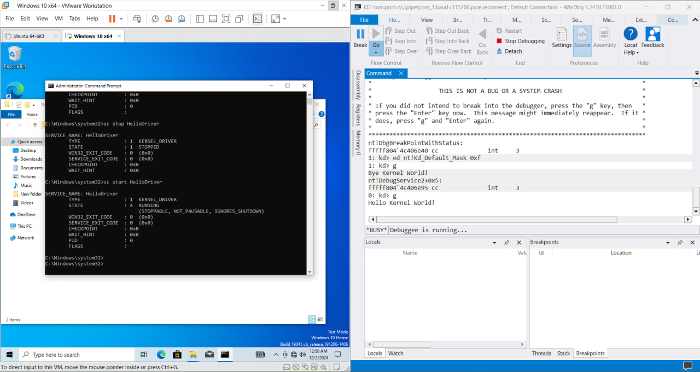

### PROJECT 1: HELLO WORLD DRIVER
## Mô tả về driver
- Dự án này tạo một driver cơ bản cho Windows Kernel nhằm minh họa cách xây dựng, tải và dỡ bỏ một driver kernel.
- Đây là một bài thực hành khởi đầu dành cho những người mới làm quen với lập trình driver kernel trong môi trường Windows.

## Giải thích 
1. Luồng hoạt động của Driver
  - Khi driver được nạp vào kernel, hệ điều hành gọi hàm DriverEntry.
  - Hàm thực hiện các công việc khởi tạo: Cài đặt thành phần quan trọng, Đăng ký hàm DriverUnload giúp hệ thống biết cách xử lý khi bị gỡ bỏ
  - DriverEntry trả về 1 mã trạng thái STATUS_SUCCESS để thông báo quá trình tải thành công.

2. DriverEntry
- Vai trò: Điểm vào chính của Driver. HDH sẽ gọi hàm này khi driver được nạp vào kernel.
- Cơ chế: Khi hệ thống yêu cầu nạp driver (qua công cụ sc.exe, hoặc các thành phần khác), Windows Loader tải driver vào bộ nhớ và gọi hàm DriverEntry

3. DriverUnload
- Vai trò: Dọn dẹp và giải phóng tài nguyên được cấp phát trong quá trình driver hoạt động. Nó đảm bảo driver được tháo gỡ an toàn, và không để lại ảnh hưởng tiêu cực tới kernel.
- Cơ chế: Khi người dùng yêu cầu dỡ bỏ driver (sử dụng lệnh 'sc stop' hoặc qua Device Manager), HDH sẽ gọi hàm để xử lý dỡ bỏ.
   
## Hướng dẫn setup
1. Cách build driver
- Tạo 1 solution trong Visual Studio (Sử dụng Empty WDM Driver)
- Cấu hình dự án
  *  Configuration: chọn Debug hoặc Release
  *  Platform: Chọn x64 hoặc x86
- Build Solution: Nhấn tổ hợp phím Ctrl + B hoặc chọn Build -> Build Solution.

2. Vị trí kết quả file build
- Sau khi build thành công, driver được biên dịch thành tệp .sys, cùng với tệp .pdb để hỗ trợ gỡ lỗi
```
<Solution Directory>\x64\Debug\<DriverName>.sys (cho Debug, x64)
<Solution Directory>\x64\Release\<DriverName>.sys (cho Release, x64)
```

## Hướng dẫn chạy
- Copy file .sys và .inf sang máy áo Vmware
- Mở terminal với quyền admin
- Thực hiện lệnh:
```
sc create <ServiceName> binPath= "<FullPathToSysFile>" type= kernel
sc start <ServiceName>
```
- Thực hiện debug trên WinDBG
## POC
