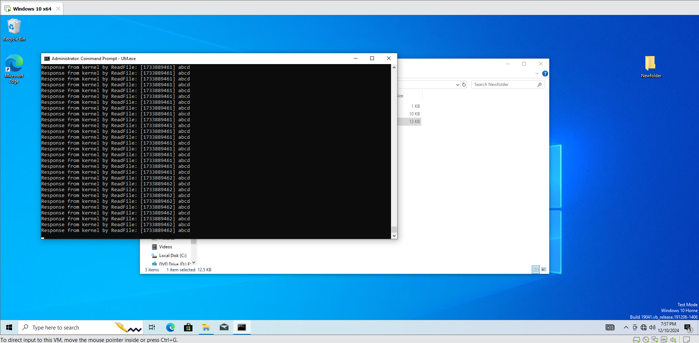

### PROJECT 2: KM-UM Communication
## Mô tả về driver
- Nhận một câu từ UM (câu không quá 100 ký tự), sau đó echo lại câu này cho UM
- Nhận một câu từ UM (câu không quá 100 ký tự), sau đó cứ mỗi 10ms sẽ trả lại câu này cho UM cùng với timestamp cho đến khi UM ngắt kết nối

## Giải thích 
Luồng hoạt động:
1. KM và UM giao tiếp với nhau sử dụng BufferedIO thông qua IOCTL
2. Sau đó, ở UM sử dụng ReadFile để liên tục tạo request đọc dữ liệu xuống cho KM và KM sẽ trả về dữ liệu đã nhận được ở trước và sử dụng DirectIO.

Cấu trúc truyền dữ liệu:
```
#define IOCTL_TEST CTL_CODE(FILE_DEVICE_UNKNOWN, 0x1337, METHOD_BUFFERED, FILE_ANY_ACCESS)
```
- FILE_DEVICE_UNKNOWN: Xác định loại thiết bị mà driver sẽ tương tác. Đây là loại thiết bị không được chỉ định cụ thể trong hệ thống.
- 0x1337: Đây là mã số cho mã lệnh IOCTL của driver
- METHOD_BUFFERED: Đây là phương thức truyền dữ liệu giữa user-mode và kernel-mode.
- FILE_ANY_ACCESS: mọi ứng dụng có thể gửi yêu cầu mà không bị hạn chế về quyền truy cập.

Buffered I/O
- Windows sẽ tạo ra một bộ đệm hệ thống, và bộ đệm này sẽ được sử dụng để chứa dữ liệu được truyền giữa user-mode và kernel-mode.
- Khi ứng dụng ở user-mode thực hiện yêu cầu (ví dụ: thông qua IOCTL hoặc ReadFile), hệ thống sẽ tự động cấp phát bộ đệm và truyền tải dữ liệu giữa hai chế độ mà không cần sự can thiệp của driver.
- Driver chỉ cần thao tác với bộ đệm do hệ thống cấp phát mà không cần phải quản lý bộ nhớ.

Direct I/O
- Windows sử dụng MDLs (Memory Descriptor Lists) để ánh xạ trực tiếp (map) bộ nhớ user-mode sang không gian kernel-mode.
- Làm việc trực tiếp trên bộ nhớ được ánh xạ

## Hướng dẫn setup
1. Cách build KMdriver
- Tạo 1 solution trong Visual Studio (Sử dụng Empty WDM Driver)
- Cấu hình dự án
  *  Configuration: chọn Debug hoặc Release
  *  Platform: Chọn x64
- Build Solution: Nhấn tổ hợp phím Ctrl + B hoặc chọn Build -> Build Solution.

2. Cách build UM
- Cấu hình dự án
  *   Configuration: Chọn Release
  * Platform: Chọn x64
- Chọn project UM, chuột phải nhấn Build

## Hướng dẫn chạy
- Copy file .sys và .inf sang máy áo Vmware
- Mở terminal với quyền admin
- Thực hiện lệnh:
```
sc create <ServiceName> binPath= "<FullPathToSysFile>" type= kernel
sc start <ServiceName>
```
- Copy file .exe trên thư mục Release ở UM sang Vmware
- Thực hiện chạy
- Thực hiện debug trên WinDBG

## POC
